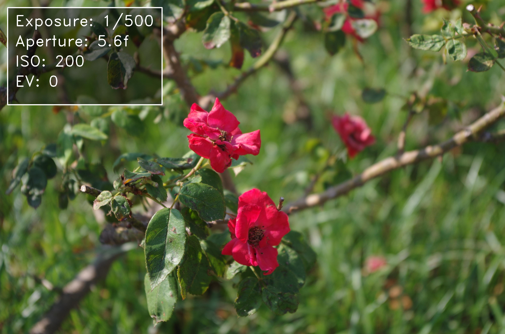
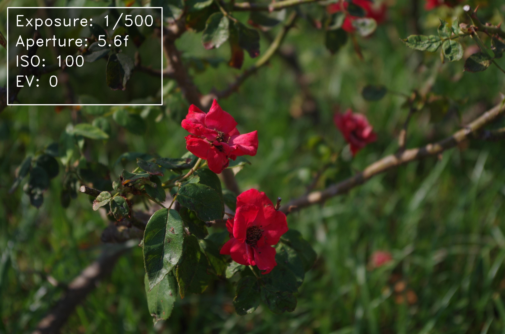
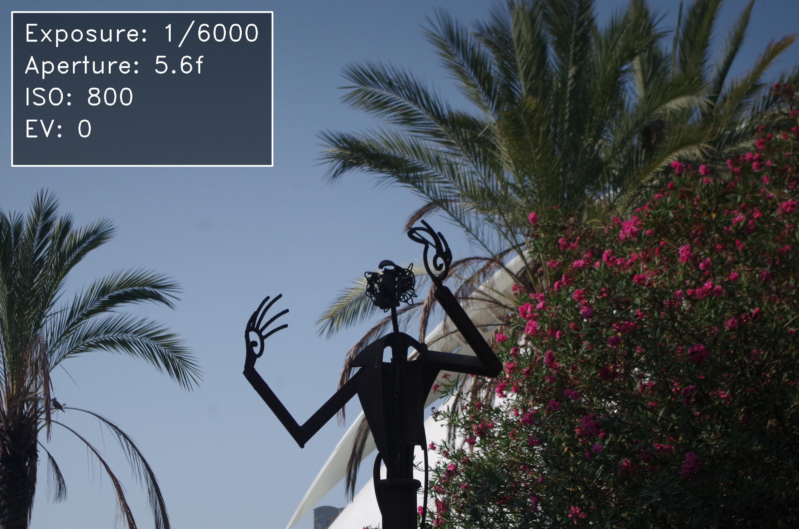

# 📸 kmera: A simple photography comparation tool

<p align="center">
  <a href="https://github.com/alrodsa/kmera/actions">
    
  </a>
  <a href="https://codecov.io/gh/alrodsa/kmera">
    
  </a>
  
  
  <a href="https://opensource.org/licenses/MIT">
    
  </a>
</p>


**kmera** is a lightweight tool for beginner (and not-so-beginner) photographers who want to **easily compare their photos with capture information embedded directly inside each image**.

<div style="display: flex; justify-content: center; gap: 20px; flex-wrap: wrap;">
  <div style="text-align: center; flex: 1 1 45%;">
    <br/>
    <sub><b>IMGP1275.JPG (original)</b></sub>
  </div>
  <div style="text-align: center; flex: 1 1 45%;">
    <br/>
    <sub><b>IMGP1275_1s500-5.6f-200.JPG</b></sub>
  </div>
  <div style="text-align: center; flex: 1 1 45%;">
    <br/>
    <sub><b>IMGP1279.JPG (original)</b></sub>
  </div>
  <div style="text-align: center; flex: 1 1 45%;">
    <br/>
    <sub><b>IMGP1279_1s500-5.6f-100.JPG</b></sub>
  </div>
</div>

The idea came from a personal experience:
> I recently started learning photography, experimenting with shutter speed, aperture, and ISO to keep the **EV at 0** (which is usually considered the “correct” exposure).
> However, when reviewing my photos, I constantly had to open multiple windows (one for the image, another for its properties), and comparing them quickly became tedious.

That’s why I built **kmera**:

- It renames each photo with its key metadata (shutter speed, aperture, ISO).
- It embeds this information directly into the image (with a clean, readable overlay).
- This way, you can compare photos side by side without digging into file properties.

Even though it’s a simple tool, I made sure the project has a **clean software architecture**, is **fully reproducible** (via devcontainer), follows **best practices**, includes **full documentation**, and has **100% test coverage** ✅.
Additionally, GitHub Actions run linting (`ruff`) and tests automatically.

## 🚀 Features

- 📂 Automatic file renaming with metadata:

   ```
   IMG001.jpg → IMG001_1s250-2.8f-100.jpg
   ```

- 🖼️ Embed metadata inside the photo itself:
  - Shutter speed
  - Aperture
  - ISO
- 📦 Devcontainer-ready (reproducible setup with VS Code + Docker).
- 🧪 Unit tests with 100% coverage.
- 🛠️ Linting and formatting with `ruff`.

## 📦 Installation

This project uses [uv](https://github.com/astral-sh/uv) as environment/dependency manager, and comes with a **devcontainer** setup.

### Option 1: Using Devcontainer (recommended ✅)

1. Clone the repository:

   ```bash
   git clone https://github.com/alrodsa/kmera.git
   cd kmera
   ```

2. Open the project in VS Code.
3. When prompted, select **"Reopen in Container"**.
   That’s it — everything will be ready to go!

### Option 2: Manual installation

1. Install `uv`:

   ```bash
   curl -LsSf https://astral.sh/uv/install.sh | sh
   ```

2. Create a virtual environment and install dependencies:

   ```bash
   uv venv .venv
   source .venv/bin/activate
   uv sync --all-extras
   ```

## ⚡ Usage

The tool uses [fire](https://github.com/google/python-fire) to expose a CLI.

Basic example:

```bash
python3 main.py naming /path/to/images --mode=copy --in_image=True --output_dir=./output
```

### Arguments

| Argument       | Type   | Values / Default | Description                                                                 |
|----------------|--------|------------------|-----------------------------------------------------------------------------|
| `input_dir`    | `str`  | —                | Path to the directory containing your images. It can include subfolders, which will also be processed recursively. |
| `--mode`       | `str`  | `copy` or `replace` | Defines how the files are handled: <br>• **copy** → Creates a new directory structure in `output_dir` with the renamed files.<br>• **replace** → Renames the original files in place (metadata is always preserved). |
| `--in_image`   | `bool` | `False`          | If set to `True`, photo metadata (exposure, aperture, ISO, etc.) will also be embedded directly inside each image. |
| `--output_dir` | `str`  | `./naming/`      | Destination folder for renamed files. Only used when `--mode=copy`. |

## 🧪 Tests

Run all tests with coverage:

```bash
pytest --cov=src --cov-report=term-missing
```

## 🔄 CI/CD

- **GitHub Actions**:
  - Runs `ruff` for linting.
  - Executes all tests with `pytest`.

Ensures consistency and quality on every commit/pull request.


## 📚 Examples

### File naming transformation

```txt
ORIGINAL DIRECTORY                 KMERA NAMING DIRECTORY
------------------                 -------------------------------------
| 📂 `input_dir/`                  📂 `naming/`
| ├── `IMG001.jpg`                 ├── `IMG001_1s250-2.8f-100.jpg`
| ├── `IMG002.png`                 ├── `IMG002_1s60-5.6f-200.png`
| ├── 📂 `subfolder_1/`            ├── 📂 `subfolder_1/`
| │   ├── `IMG101.jpg`             │   ├── `IMG101_1s125-4.0f-400.jpg`
| │   ├── `IMG102.png`             │   ├── `IMG102_2s-8.0f-100.png`
| ├── 📂 `subfolder_2/`            ├── 📂 `subfolder_2/`
| │   ├── `IMG201.jpg`             │   ├── `IMG201_1s30-1.8f-800.jpg`
| │   ├── 📂 `nested/`             │   ├── 📂 `nested/`
| │   │   ├── `IMG301.png`         │   │   ├── `IMG301_1s500-2.0f-100.png`
```

### Inside-image transformation

<div style="display: flex; justify-content: center; gap: 20px; flex-wrap: wrap;">
  <div style="text-align: center;">
    <br/>
    <sub><b>IMGP1275.JPG (original)</b></sub>
  </div>
  <div style="text-align: center;">
    <br/>
    <sub><b>IMGP1275_1s6000-5.6f-800.JPG</b></sub>
  </div>
</div>

## 📜 License

This project is licensed under the **MIT License**.
Feel free to use, modify, and contribute!


## ✨ Personal Motivation

This project was born as a way to combine **photography learning** and **software passion**:

- Learn photography by experimenting with **EV 0**.
- Compare photos without digging into file properties.
- Practice good development practices (clean structure, reproducibility, tests, CI).

Small project, **big motivation** ❤️
